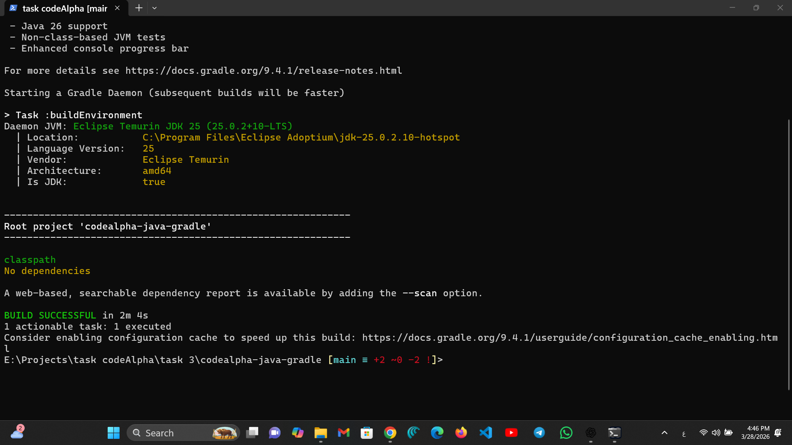
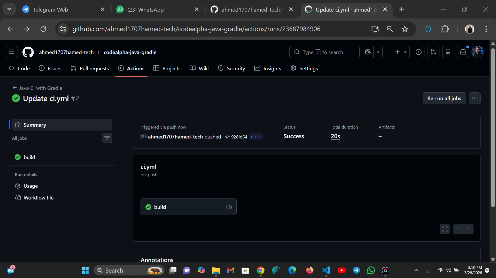

# 🚀 CodeAlpha Java Gradle Application

## 📌 Overview

This project demonstrates building a Java application using **Gradle** and integrating it with a **CI/CD pipeline using GitHub Actions**.

---

## 🛠️ Technologies Used

* Java (JDK 17+)
* Gradle
* Git & GitHub
* GitHub Actions (CI/CD)

---

## ⚙️ Features

* Automated build using Gradle
* Dependency management
* CI/CD pipeline with GitHub Actions
* Cross-platform execution using Gradle Wrapper

---

## 📂 Project Structure

```
CodeAlpha_JavaGradleApp/
│
├── .github/workflows/ci.yml
├── assets/images/
├── src/main/java/App.java
├── build.gradle
├── settings.gradle
├── gradlew
├── gradlew.bat
```

---

## 🚀 Run Locally

```bash
git clone https://github.com/YOUR_USERNAME/codealpha-java-gradle.git
cd codealpha-java-gradle
./gradlew run
```

---

## 🔨 Build

```bash
./gradlew build
```

---

## 🔄 CI/CD

Pipeline runs automatically on every push using GitHub Actions.

---

## 📸 Screenshots

### Gradle Build Success



### GitHub Actions Success



---

## 📊 Output

```
Hello CodeAlpha DevOps 🚀
```

---

## 👨‍💻 Author

Ahmed Hamed


